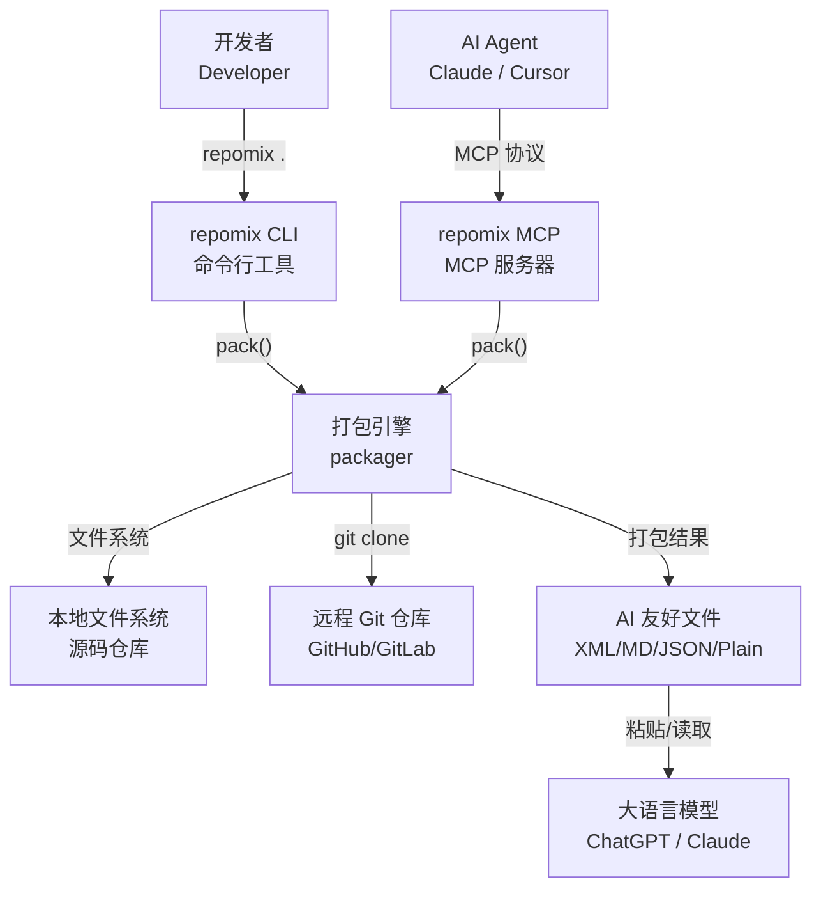

# repomix-rs：把代码库喂给 AI 的"打包工"

你正在开发的软件项目有几十上百个文件，你想让 ChatGPT 或 Claude 理解你的整个代码库，好让它们帮忙重构、审查或写文档。但 AI 的上下文窗口有限，一次只能看几个文件。你需要一个工具，能把整个仓库整理成一份结构清晰的「项目全景图」。

这就是 repomix-rs 做的事。它是一个用 Rust 重写的 [Repomix](https://github.com/yamadashy/repomix)（原版 TypeScript 实现），收到的是一堆零散的源码文件，交付的是一份 AI 可以一次性摄入的结构化文档——包含目录树、每个文件的完整内容、精确的 token 计数、按活跃度排序的文件排名、安全扫描报告，甚至还有最近的 git 变更记录。

为什么用 Rust 重写？因为速度。原版 Node.js 实现在 5000 个文件的仓库上需要约 15 秒，repomix-rs 将这一时间压缩到了 2-3 秒。这种差距在 CI/CD 流水线或 MCP 服务器的实时响应场景中感受最为明显。

## 它能做什么

repomix-rs 的核心能力可以概括为"从源码到 AI 文档的全自动流水线"。你给它一个项目目录或一个远程 Git URL，它就会自动遍历所有文件、按需压缩代码签名、计算精确的 token 数、生成多种格式的输出文件。

**多格式输出**——支持 XML、Markdown、Plain、JSON 四种输出格式。XML 是默认格式，结构完整（文件元数据用属性标注），最适合 AI 理解代码的层次关系。Markdown 格式人类可读性好。JSON 格式方便 CI/CD 流水线做后续处理。Plain 最轻量，追求最低的 token 开销。

**Tree-sitter 智能压缩**——这是 repomix-rs 最具技术含量的功能。它能解析 10 种编程语言的语法结构，提取函数签名、类定义、类型声明等信息，同时去掉函数体等高 token 密度的实现细节。AI 不需要看到每个函数的完整实现也能理解代码的 API 设计，而 token 消耗可以降低 40-60%。

**Git 感知的智能排序**——按文件被修改的频率排序，把最近最活跃的文件排在前面。这背后的逻辑很简单：AI 应该优先关注那些正在被积极开发的代码，而不是尘封已久的基础设施。

**安全扫描先行**——没有人想把 API 密钥喂给 AI。repomix-rs 内置了 Secretlint 引擎，用正则 + 熵检测 + 白名单三层过滤自动识别并排除含密钥的文件。而且它很聪明——知道 `#[test]` 块中的"密钥"是测试夹具，不会误报。

## C4 Context 图（系统全景）

下面的图展示了 repomix-rs 在生态系统中的位置——它处于「开发者/Agent」和「AI 模型」之间的桥梁位置，连接着源码仓库和 LLM 的上下文窗口。

从图中可以看出一个关键设计决策：CLI 和 MCP 是两套完全独立的入口，但它们通过同一个 `pack()` 函数共享完全相同的处理引擎。这意味着无论用户是从终端敲命令还是通过 AI Agent 自动调用，得到的都是相同的打包质量。

## 技术选型背后的思考

repomix-rs 的技术选型体现了"为性能而设计"的理念——但不是盲目追求快，而是**在正确的地方用正确的并行策略**。

| 技术领域 | 具体选择 | 为什么这样选 |
|---------|---------|------------|
| 语言与运行时 | Rust (edition 2021) + Tokio | Rust 的内存安全 + 零成本抽象让高性能原生编译成为可能。Tokio 提供成熟的异步运行时，处理文件 I/O 这类密集型任务 |
| 文件系统遍历 | `ignore` crate | 这是 ripgrep 的同款引擎——多线程并行、原生支持 .gitignore、比 Node.js 的 globby 快 3-5 倍 |
| 数据并行 | Rayon | Rust 生态中无可替代的数据并行库。文件读取和内容处理用 `par_iter` 自动分布到所有 CPU 核，且保证无数据竞争 |
| 代码解析 | tree-sitter | 支持增量式解析，原生 Rust 绑定（不需要 WASM-in-a-Worker 的奇技淫巧），覆盖 10 种主流语言 |
| Token 计数 | tiktoken-rs | OpenAI 官方 tokenizer 的 Rust 绑定，精确匹配 GPT-4o/GPT-4 等主流模型的 token 计算方式 |
| MCP 协议 | rmcp | Anthropic 官方的 Rust MCP SDK，原生支持类型安全的工具注册（`#[tool]` 宏）和 JSON-RPC 通信 |

## repomix-rs 能做什么，不能做什么

理解"边界"和"能力范围"同样重要。repomix-rs 擅长把源码转换成 AI 容易消化的格式，但**它不试图理解或分析你的代码**。这是一个有意的设计选择。

**它能做的事**：把任何规模的代码仓库整理成结构化的长文档，包含目录树、文件内容、统计指标、安全警告、git 上下文——所有这些都打包在一个文件中，AI 可以一次性摄入。

**它不做的事**：不做语义化的代码分析或解释。它不会说"这段代码是为了实现用户认证"，它只是忠实地把源码切片、编号、格式化。把"理解"这件事留给 LLM。它也不提供交互式浏览界面——输出是静态文件，不是 web 应用。

---

> **置信度评分**：9/10 — 基于对全部 11 个模块的源码解读和完整流水线追踪，所有功能描述均可对应到具体代码位置。
