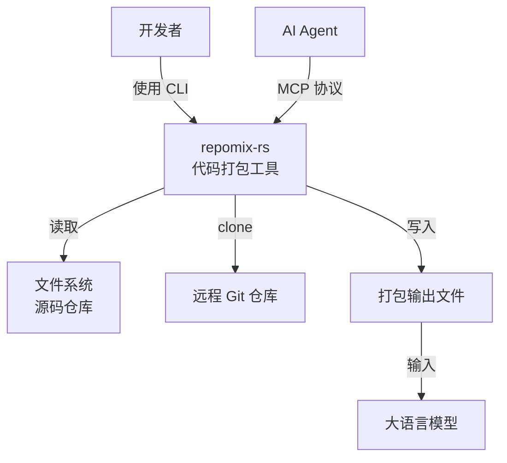
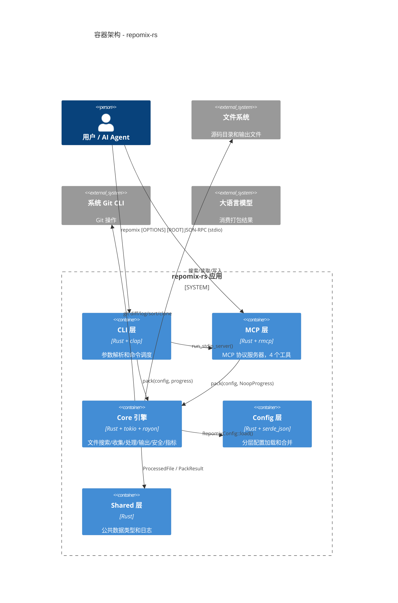
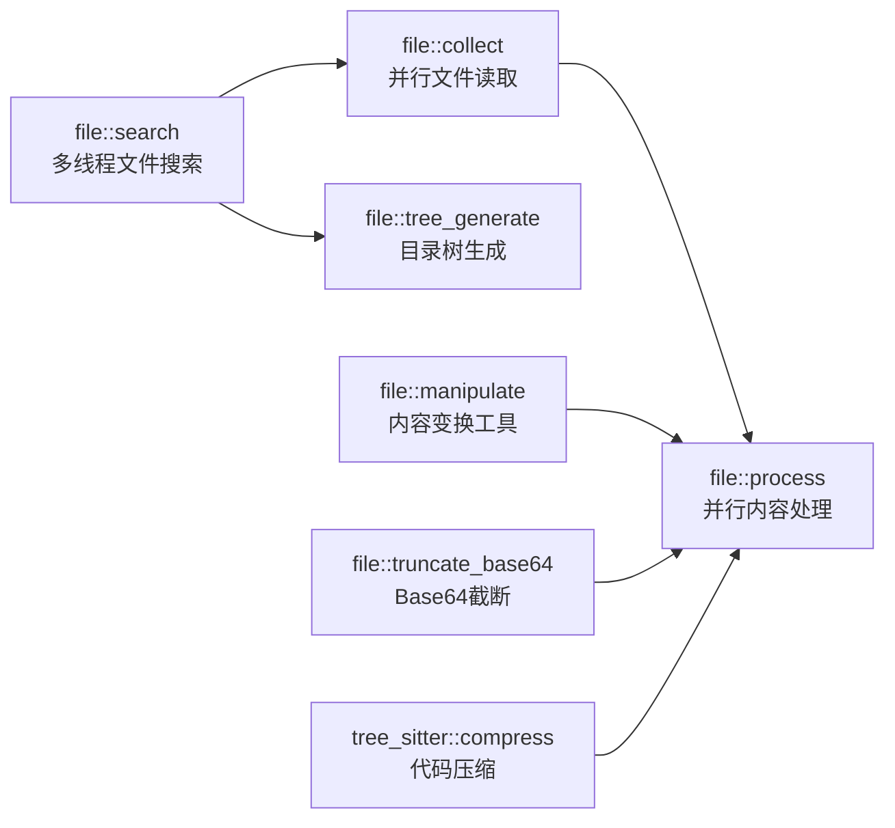
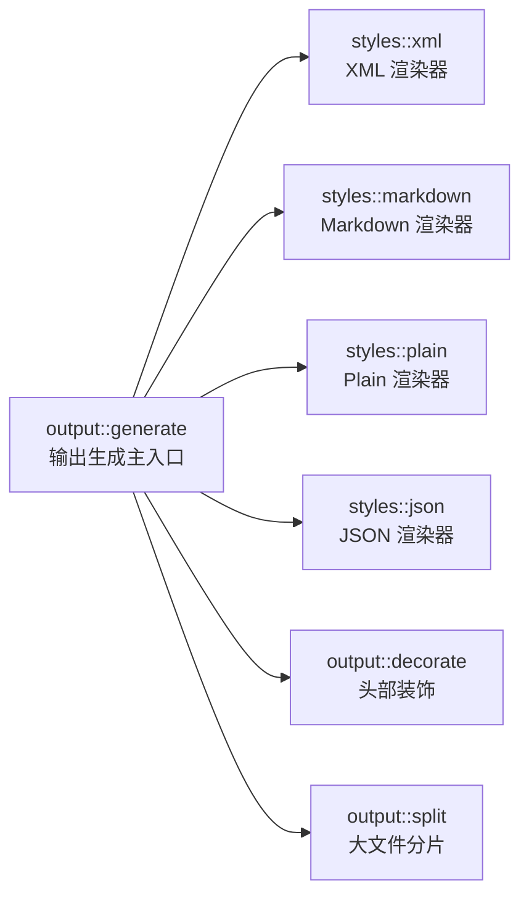
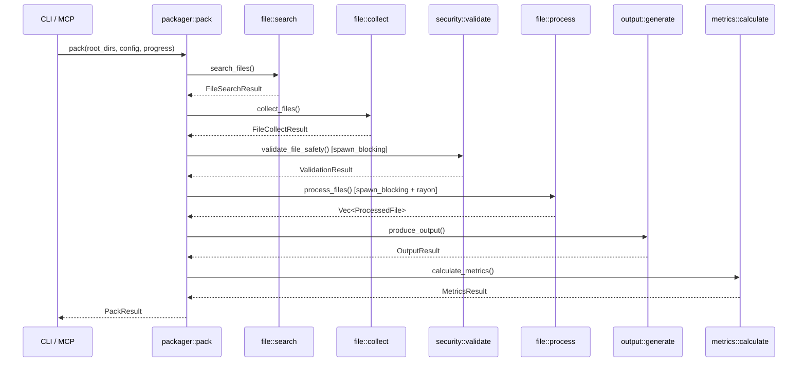
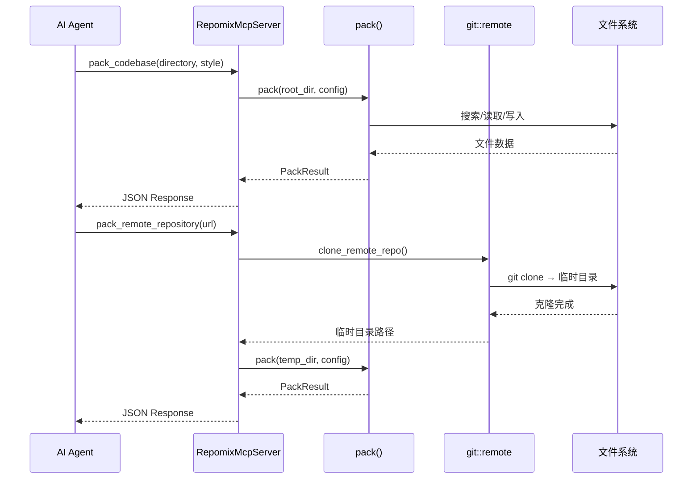

# 系统架构文档：repomix-rs

**版本：** 1.0
**分类：** 内部架构文档
**生成日期：** 2026-06-14

---

## 1. 架构概述

### 1.1 设计理念

repomix-rs 的架构可以用一句话概括：**一条单向流水线，四个独立层次，三个并行引擎**。这三个数字不是巧合——它们对应了三种不同的设计决策，每种决策都解决了一个特定的工程挑战。

**1. 管道-过滤器（Pipeline-Filter）模式**
这是 repomix-rs 最核心的架构决策。packager 作为总控台，定义了 6 道顺序执行的工序：搜索→收集→安全扫描→处理→输出生成→指标计算。每道工序接收上一道的输出（标准化的数据结构），处理后传给下一道。这种模式的优雅之处在于：每道工序可以独立优化、独立测试、独立失败。未来要添加新的处理步骤（比如依赖关系分析），只需在管道中插入新的工位，不影响现有工序。代码体现：`crates/core/src/packager.rs:108` 的 `pack()` 函数中，6 个调用严格按序排列。

**2. 分层模块化（Layered Modularity）**
在 crate 层面，项目分为三层：顶层（cli/mcp）是用户接口层，薄薄的一层外壳；中间层（core）是业务逻辑层，所有实质性工作在这里完成；底层（config/shared）是基础设施。这种分层不是理论上的条条框框——它解决了真实的编译问题：MCP crate 不应该意外引入 clap 依赖，CLI crate 不应该直接调用 tree-sitter。工作区结构（`Cargo.toml:2-8` 定义了 5 个成员）确保了依赖边界的清晰。

**3. 三引擎并行（Three-Engine Parallelism）**
不是所有并发工作都适合用同一种方式处理。tokio 异步用于顶层编排（等待但不阻塞），rayon 数据并行用于 CPU 密集型批量处理（自动利用所有核心），spawn_blocking 用于文件 I/O（避免阻塞 tokio 的异步工作线程）。三种引擎各司其职，互不干扰。

### 1.2 核心架构模式

| 模式 | 实现方式 | 目的 |
|------|---------|------|
| 管道-过滤器 | `pack()` 按序调用 6 个子模块 | 每道工序独立可测、独立可优化，新工序可插入 |
| 分层模块化 | Cargo workspace + 5 crates | 依赖边界清晰，编译增量优化，防止 crate 间耦合泄露 |
| 三引擎并行 | tokio + rayon + spawn_blocking | IO 密集和 CPU 密集工作使用不同的并行策略 |
| Builder 模式 | `PackOptions` 链式 API | 类型安全地构建打包选项，避免构造函数参数爆炸 |
| 策略模式 | `ProgressCallback` trait | packager 不关心进度如何展示，由调用方决定 |

### 1.3 技术栈概述

repomix-rs 依赖 20+ 个外部 crate，但以下 6 个决定了其核心架构：

- **tokio**（>150 万行依赖）——异步运行时，支撑顶层编排和 MCP 服务器的事件循环
- **rayon**（无锁数据并行）——文件收集和处理的并行基础，实现了自动工作窃取调度
- **clap**（派生宏声明式参数）——定义 15+ CLI 参数，零成本解析
- **ignore**（ripgrep 同源引擎）——多线程 gitignore 感知的文件树遍历
- **tree-sitter**（原生解析器绑定）——10 语言 AST 解析和代码签名提取
- **rmcp**（官方 MCP SDK）——类型安全的 MCP 协议实现

---

## 2. 系统上下文（C4 Level 1）

---

## 3. 容器视图（C4 Level 2）

### 3.1 领域模块职责

| 模块/领域 | 路径 | 职责 | 关键抽象 |
|---------|------|------|---------|
| packager | `crates/core/src/packager.rs` | 打包流水线编排 | `pack()`, `PackOptions`, `PackResult`, `ProgressCallback` |
| file | `crates/core/src/file/` | 文件搜索/收集/处理/树生成 | `search_files()`, `collect_files()`, `process_files()` |
| output | `crates/core/src/output/` | 输出样式生成 | `produce_output()`, `OutputResult` |
| tree_sitter | `crates/core/src/tree_sitter/` | 代码签名提取 | `compress_file()`, `LanguageConfig` |
| security | `crates/core/src/security/` | 密钥检测 | `SecretRule`, `scan_file_content()` |
| git | `crates/core/src/git/` | Git 操作 | `get_git_diffs()`, `sort_by_git_changes()` |
| metrics | `crates/core/src/metrics/` | Token 计数和统计 | `TokenCounter`, `calculate_metrics()` |
| config | `crates/config/` | 配置加载 | `RepomixConfig`, `PartialConfig`, `load()` |
| cli | `crates/cli/` | CLI 入口 | `Cli` (clap Parser), `run_pack()` |
| mcp | `crates/mcp/` | MCP 服务器 | `RepomixMcpServer`, `PackToolResult` |
| shared | `crates/shared/` | 共享类型 | `RawFile`, `ProcessedFile`, `SuspiciousFileResult` |

---

## 4. 组件视图（C4 Level 3）

### 4.1 file 模块组件架构

**组件职责：**
- `file::search`：使用 `ignore::WalkBuilder` + glob 过滤搜索文件，自动处理 gitignore
- `file::collect`：rayon 并行读取文件，支持 UTF-8/16 自动检测和二进制过滤
- `file::process`：rayon 并行处理内容（压缩/注释去除/截断/行号），可选链式变换
- `file::tree_generate`：将文件路径列表渲染为 tree 命令风格的目录树
- `file::manipulate`：提供 `remove_comments`、`remove_empty_lines`、`add_line_numbers` 等函数
- `file::truncate_base64`：检测并截断过长的 base64 编码块

### 4.2 output 模块组件架构

---

## 5. 关键流程

### 5.1 打包主流程

### 5.2 MCP 工具调用流程

---

## 6. 技术实现

### 6.1 关键架构模式

**Builder 模式**——`PackOptions`（`crates/core/src/packager.rs:44`）使用链式 API 提供类型安全的选项配置。诸如 `PackOptions::new(dir).with_style(Markdown).with_compress(true)` 的调用方式避免了构造函数参数爆炸的经典问题。

**Strategy 模式**——`ProgressCallback` trait（`crates/core/src/packager.rs:94`）定义了 3 个方法，packager 在每道工序开始/结束时回调。CLI 提供 `Spinner` 实现（显示转圈动画），MCP 提供 `NoopProgress` 实现（静默处理）。调用方可以自由实现自己的进度展示方式。

### 6.2 并发和并行策略

- **文件搜索**：`ignore::WalkBuilder` 自带多线程（`threads(num_cpus::get())`），自动利用所有核心
- **文件收集与处理**：`rayon::par_iter()` 实现数据并行，每个工作线程独立处理一批文件
- **顶层编排**：`tokio` 异步函数 `async fn pack()`，各阶段通过 `.await` 等待但不阻塞
- **阻塞操作**：涉及文件 I/O 的操作使用 `tokio::task::spawn_blocking` 投递到独立的阻塞线程池

### 6.3 性能优化策略

- **懒编译**：默认忽略模式使用 `LazyLock`（`crates/core/src/file/search.rs:12`），首次搜索时编译一次，后续复用
- **全局缓存**：Secret 规则使用 `OnceLock`（`crates/core/src/security/secretlint.rs:16`），7 条正则只编译一次
- **跳过无变换路径**：`process_single_file()` 中如果所有变换开关都关闭（`needs_transform`），直接使用原始内容，避免不必要的 clone
- **零拷贝路径处理**：`display_path()` 只在相对/绝对路径转换时做字符串操作，不重复分配

---

## 附录：架构决策记录（ADR）

**ADR 1：多 crate 工作区 vs 单 crate 单体**
- **决策**：使用 Cargo workspace 将项目拆分为 5 个独立 crate
- **原因**：依赖边界清晰——MCP 代码不能意外引入 clap 依赖，编译时增量优化更有效
- **后果**：增加了代码组织的前期成本，但长期维护和编译效率大幅受益

**ADR 2：rayon + spawn_blocking vs 纯 tokio 异步**
- **决策**：文件 I/O 操作使用 spawn_blocking，CPU 密集操作使用 rayon
- **原因**：`std::fs::read` 和 `std::fs::metadata` 本质上是阻塞操作，在 tokio 异步线程上执行会阻塞其他异步任务
- **后果**：代码中混用了 `async/await` 和 `spawn_blocking`，需要开发者理解何时使用哪种

**ADR 3：ignore crate vs walkdir + 手写 .gitignore 解析**
- **决策**：使用 `ignore` crate 进行文件树遍历
- **原因**：`ignore` crate 是 ripgrep 同源，已成熟处理了 .gitignore 解析、多线程遍历、隐藏文件过滤等复杂逻辑
- **后果**：引入了一个"额外"的外部依赖，但避免了数百行容易出错的 .gitignore 解析代码

**ADR 4：自研 Secretlint vs 引入外部安全工具**
- **决策**：自研基于正则 + 熵检测 + allowlist 的 secret 检测引擎
- **原因**：外部工具（如 truffleHog、Gitleaks）无法理解 Rust 的 `#[test]` 块中的"假密钥"是测试夹具
- **后果**：检测能力不如专业工具全面，但在代码打包场景中误报率极低
