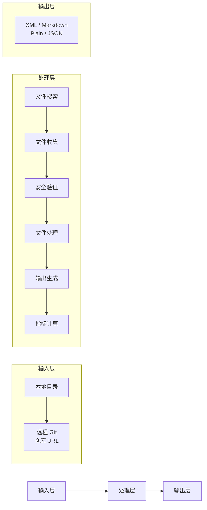
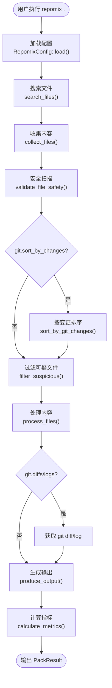
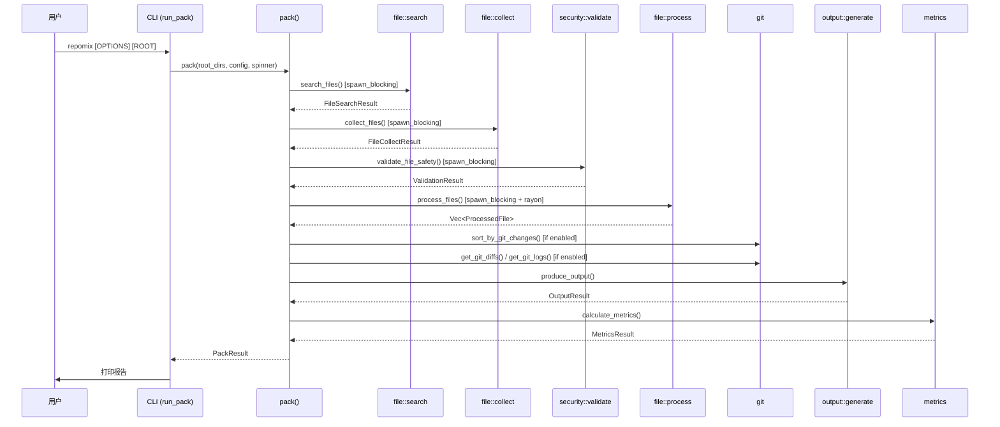
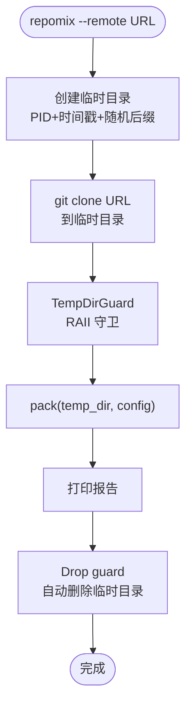
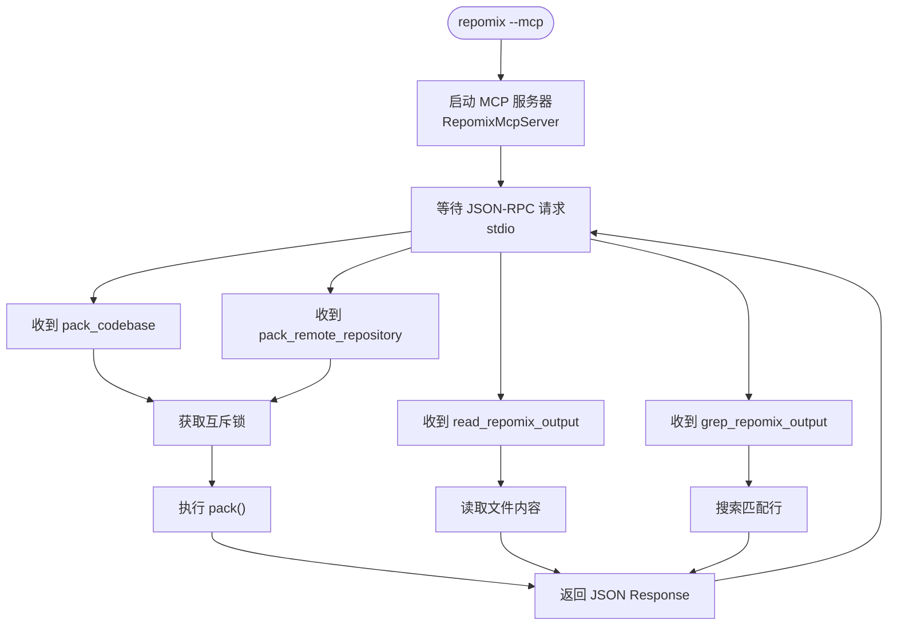

# 核心工作流

## 1. 工作流概述

### 1.1 系统架构与工作流理念

repomix-rs 的工作流可以用一个简单的比喻来理解：它就像一条**文档自动化生产线**。原材料（源码仓库）进入流水线后，依次经过搜索工位（找出所有需要处理的文件）、拆包工位（读取文件内容）、质检工位（安全扫描）、加工工位（压缩/格式化）、包装工位（生成输出文件），最后称重出厂（指标统计）。

这条流水线有两个关键设计理念：第一，**每道工位独立运转**——搜索工位不需要关心包装工位如何排版，包装工位不需要关心拆包工位如何读取编码。第二，**并行是默认，串行是特例**——能并行的地方一定并行（文件收集、文件处理、安全扫描都在各自的线程池中并行），只在必要时串行（输出生成必须等所有文件处理完成，因为需要完整的文件列表）。

### 1.2 核心执行路径

---

## 2. 主要工作流

### 2.1 本地目录打包

这是 repomix-rs 最核心、最常用的工作流。用户执行 `repomix .` 或带各种参数，系统从当前目录出发，完成完整的六道工序。

#### 流程图

#### 时序图

#### 阶段说明

| 阶段 | 执行者 | 输入 | 输出 | 说明 |
|------|-------|------|------|------|
| 配置加载 | `config::load` | CLI 参数 + 配置文件 | `RepomixConfig` | 四层合并：默认→全局→项目→CLI |
| 文件搜索 | `file::search` | 仓库目录 + 配置 | `FileSearchResult` | ignore 多线程遍历，glob 过滤 |
| 文件收集 | `file::collect` | 文件路径列表 | `FileCollectResult` | rayon 并行读取，编码检测 |
| 安全扫描 | `security::validate` | 原始文件 | `ValidationResult` | 7 条规则匹配 + 假阳性过滤 |
| 文件处理 | `file::process` | 原始文件 + 配置 | `Vec<ProcessedFile>` | rayon 并行，压缩/注释去除 |
| 输出生成 | `output::generate` | 处理后的文件 | `OutputResult` | 4 种格式，含分片/剪贴板 |

### 2.2 远程仓库打包

用户执行 `repomix --remote https://github.com/owner/repo`，系统先克隆远程仓库，再对克隆的本地副本执行标准打包流程。

#### 流程图

### 2.3 MCP 服务器模式

用户执行 `repomix --mcp` 后，进程以 MCP 服务器方式通过 stdio 与客户端通信。AI Agent 可以远程调用打包能力。

#### 流程图

---

## 3. 并发与异步模型

repomix-rs 采用了"三引擎并行"的并发策略——不是用一通用模型处理所有工作，而是为不同类型的工作选择最合适的工具。这个策略的核心洞察是：**文件 I/O、CPU 密集型计算、异步等待是三种本质上不同的并发需求，不应该用同一种技术解决**。

| 引擎 | 用途 | 使用的场景 |
|------|------|-----------|
| `tokio` async/await | 顶层编排，等待但不阻塞 | `pack()` 函数的 6 阶段调度 |
| `rayon` par_iter | 数据并行 CPU 密集 | 文件收集（`collect_files`）、文件处理（`process_files`）、文件排序（`sort_by_git_changes`） |
| `spawn_blocking` | 阻塞式文件 I/O | 文件搜索（`ignore::WalkBuilder`）、安全扫描（逐行 regex 匹配） |

## 4. 错误处理策略

repomix-rs 的错误处理核心理念是"**局部失败不影响全局**"——一个文件的处理失败、一个可选功能的调用失败，都不应该导致整个打包流程崩溃。

- **可跳过失败**：文件读取失败（控制台 warning + 跳过该文件）、tree-sitter 压缩失败（回退到纯文本，发 warning）、git diff/log 获取失败（跳过 git 功能，发 warning）、剪贴板复制失败（只在桌面环境可用，headless 环境发 warning）、tiktoken 初始化失败（降级到空白分割估算，发 warning）
- **全局性失败**：配置加载失败（`anyhow::bail`，终止流程）、输出文件无法写入（`anyhow::bail`，终止流程）
- **优雅降级**：配置降级（clap 无效参数直接拒绝退出，但配置文件的无效参数只打 warning）、编码降级（UTF-8 检测失败 → chardetng 自动检测 → 所有编码都失败才跳过）、token 计数降级（tiktoken 不可用 → 空白分隔估算，发 warning 说明 CJK 文本可能不准）
