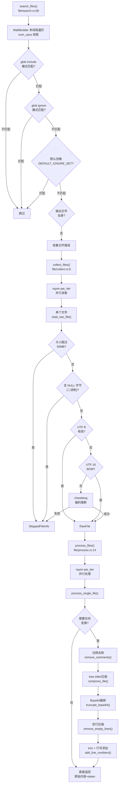

# File 领域

**模块路径**：`crates/core/src/file/`
**生成日期**：2026-06-14
**分析置信度**：9/10

---

## 概述

File 模块是流水线的"原材料车间"——它负责把散落在文件系统各处的源码文件找到、读取、甄别、加工。你可以把它想象成一个"拆包站"：将项目目录这个"大包裹"拆开，对每件物品做初步检查（大小、编码、是否二进制），然后按需做不同层次的加工。

---

## 核心功能点

1. **多线程文件搜索**：`search_files()`（`crates/core/src/file/search.rs:58`）使用 `ignore::WalkBuilder`（ripgrep 同款引擎）进行多线程目录遍历。它自动遵守 `.gitignore` 规则，支持自定义 include/ignore glob 模式，内置二进制/媒体/存档文件类型的默认忽略列表（`DEFAULT_IGNORE_SET`）。搜索还会自动排除输出文件自身（不包含自己的输出）。

2. **智能文件读取**：`collect_files()`（`crates/core/src/file/collect.rs:9`）用 `rayon` 并行读取文件内容。它对编码的智能程度令人印象深刻：先试 UTF-8，再试 UTF-16 BOM，最后用 `chardetng` 库自动推断编码。二进制文件（含 NULL 字节）和超大文件（超过 `max_file_size`）被跳过。

3. **多阶段内容处理**：`process_files()`（`crates/core/src/file/process.rs:14`）是流水线的"加工车间"。处理分两个阶段：Phase 1 用 `rayon` 并行执行 CPU 密集型变换（注释去除、tree-sitter 压缩）；Phase 2 串行执行顺序敏感的轻量变换（Base64 截断、空行压缩、trim、行号添加）。

4. **目录树生成**：`tree_generate.rs` 提供将文件/目录路径列表渲染为类似 `tree` 命令输出的功能，支持带行数统计的拓展版本。

---

## 关键组件

| 组件/类型 | 文件路径 | 核心职责 |
|---------|---------|---------|
| `search_files()` | `crates/core/src/file/search.rs:58` | 异步入口→spawn_blocking→同步搜索 |
| `search_files_sync()` | `crates/core/src/file/search.rs:70` | WalkBuilder 遍历 + glob 过滤 + 默认忽略 |
| `DEFAULT_IGNORE_SET` | `crates/core/src/file/search.rs:12` | LazyLock 预编译默认忽略 GlobSet |
| `collect_files()` | `crates/core/src/file/collect.rs:9` | 异步入口→rayon 并行读取 |
| `collect_files_sync()` | `crates/core/src/file/collect.rs:20` | 同步实现，含编码检测 |
| `read_raw_file()` | `crates/core/src/file/collect.rs:51` | 单文件读取：大小→二进制→编码 |
| `process_files()` | `crates/core/src/file/process.rs:14` | rayon 并行处理入口 |
| `process_single_file()` | `crates/core/src/file/process.rs:42` | 单文件变换流水线 |
| `generate_tree_string()` | `crates/core/src/file/tree_generate.rs` | 渲染目录树文本 |

---

## 内部数据流

**关键步骤说明**：
1. 搜索阶段：`WalkBuilder::new(dir).hidden(true).git_ignore(true).threads(num_cpus::get())` — 开启隐藏文件过滤，遵守 gitignore，充分利用多核
2. 收集阶段：单次 I/O 读取，先检查大小（避免大文件浪费 I/O），再检查二进制（前 64KB 查 NULL 字节），最后编码检测
3. 处理阶段：Phase 1（注释/压缩）在 rayon 的工作窃取调度器上并行；Phase 2（截断/空行/trim/行号）在单线程串行执行

---

## 关键接口与扩展点

- **搜索扩展**：通过 `include_patterns` 和 `ignore_patterns` 灵活控制搜索范围
- **处理扩展**：`ProcessContentOptions` 的布尔开关控制每个变换的执行。添加新变换只需在该结构中加字段、在 `process_single_file()` 的变换链中加步骤
- **默认忽略扩展**：在 `repomix_config::default_ignore::default_ignore_patterns()` 中加模式

---

## 与其他模块的交互

| 交互模块 | 方向 | 接口/协议 | 说明 |
|---------|------|---------|------|
| tree_sitter | 依赖 | `compress_file()` | process 阶段可选调用的代码压缩 |
| metrics::token_count | 依赖 | `TokenCounter` | 对每个文件计算 token 数 |
| config::default_ignore | 依赖 | `default_ignore_patterns()` | 编译默认忽略模式列表 |
| config::schema | 依赖 | `RepomixConfig`, `OutputConfig` | 读取压缩/注释/行号等配置 |

---

## 跨模块协作场景

**在完整的打包流程中**：file 模块的三个主要函数被 packager 顺序调用。搜索阶段产出的 `FileSearchResult` 被传给收集阶段；收集阶段的 `FileCollectResult` 包含 `RawFile` 列表，安全扫描后传给处理阶段；处理阶段的 `Vec<ProcessedFile>` 传给 output 模块生成最终文件。

---

## 性能考量

- **文件搜索**：`ignore::WalkBuilder` 使用 `num_cpus::get()` 线程数，与系统核心数匹配
- **文件收集**：`rayon::par_iter()` 将文件读取分配到所有工作线程
- **文件处理**：同样使用 `rayon`，CPU 密集型操作（tree-sitter 压缩、注释去除）在并行内完成
- **懒编译**：`DEFAULT_IGNORE_SET` 使用 `LazyLock` 编译一次，后续搜索复用

---

## 实现亮点

- **编码检测降级链**：UTF-8 → UTF-16 BOM → chardetng。最精确的方案首选，不引入额外依赖时不失败
- **无变换短路**：`process_single_file()` 在 `needs_transform` 为 false 时直接复用原始内容，避免不必要的 clone 和变换操作（`crates/core/src/file/process.rs:48-62`）
- **默认忽略预编译**：所有默认忽略模式在进程生命周期内编译一次为 `GlobSet`，后续搜索直接调用 `is_match()`

---

**分析置信度说明**：9/10 — 完整阅读了 search、collect、process、tree_generate 四个核心文件。module index（`mod.rs`）和辅助文件（types.rs、manipulate.rs）阅读确认。功能描述均可在代码中找到精确对应。
