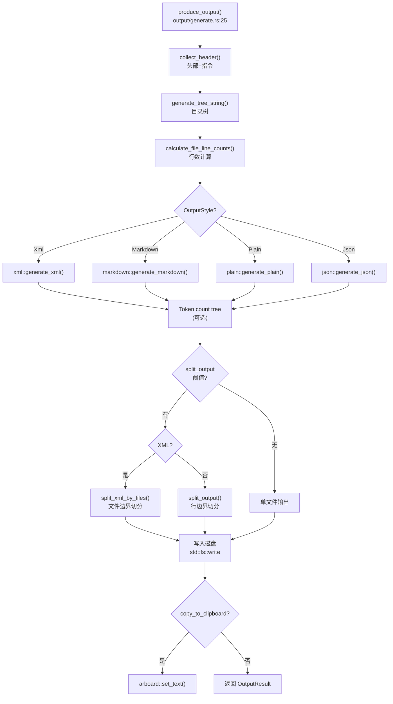

# Output 领域

**模块路径**：`crates/core/src/output/`
**生成日期**：2026-06-14
**分析置信度**：8/10

---

## 概述

Output 模块是流水线的"包装车间"——所有经过预处理的文件内容在这里被组装成最终交付的成品。它根据用户选择的"包装风格"（XML/Markdown/Plain/JSON）决定排版格式，决定是否在包装上附带目录树，还要决定当"货物"太大时智能分拆成多个小包。在写入磁盘后，它还会尝试将内容复制到系统剪贴板（`--copy` 参数）。

---

## 核心功能点

1. **四格式渲染**：`produce_output()`（`crates/core/src/output/generate.rs:25`）根据 `config.output.style` 分发到四个独立的渲染器：`xml::generate_xml()`、`markdown::generate_markdown()`、`plain::generate_plain()`、`json::generate_json()`。每种格式有自己专有的文件（`styles/xml.rs`、`styles/markdown.rs` 等）。

2. **智能分片**：当输出总 token 数超过 `split_output` 阈值时，XML 格式按文件边界切分（保证每片 XML 结构完整）；其他格式先渲染完整文本再按行切分。分片后的文件命名用 `.1`、`.2` 后缀区别。

3. **输出装饰**：通过 `collect_header()`（`crates/core/src/output/decorate.rs:10`）收集用户自定义的头部文本和指令文件内容，自动附加到输出文件的对应位置。

4. **剪贴板集成**：当 `copy_to_clipboard` 启用时，使用 `arboard::Clipboard::set_text()` 将输出内容复制到系统剪贴板。headless/SSH 环境的失败只打 warning。

---

## 关键组件

| 组件/类型 | 文件路径 | 核心职责 |
|---------|---------|---------|
| `produce_output()` | `crates/core/src/output/generate.rs:25` | 输出生成主入口 |
| `OutputResult` | `crates/core/src/output/generate.rs:15` | 输出结果结构 |
| `OutputHeader` | `crates/core/src/output/decorate.rs:4` | 头部文本+指令内容 |
| `split_output()` / `split_xml_by_files()` | `crates/core/src/output/split.rs` | 大文件分片 |
| `copy_to_clipboard()` | `crates/core/src/output/generate.rs:231` | 剪贴板复制 |
| `generate_xml()` | `crates/core/src/output/styles/xml.rs` | XML 渲染器 |
| `generate_markdown()` | `crates/core/src/output/styles/markdown.rs` | Markdown 渲染器 |
| `generate_plain()` | `crates/core/src/output/styles/plain.rs` | Plain 渲染器 |
| `generate_json()` | `crates/core/src/output/styles/json.rs` | JSON 渲染器 |

---

## 内部数据流

**关键步骤说明**：
1. 头部收集：`header_text` 放在输出最前面，`instruction_file_path` 内容放在输出末尾
2. 目录树生成：将 `Vec<String>` 路径列表渲染为 `tree` 命令风格的换行文本
3. 分片逻辑：XML 按文件边界切分（逐文件计算累计 token），非 XML 整片渲染后按行切分

---

## 关键接口与扩展点

4 种格式生成器以普通函数形式组织，没有统一 trait。添加第 5 种格式需要：
1. 新建 `styles/new.rs`
2. 在 `produce_output()` 的 `match` 中添加分支
3. 在 `OutputStyle` 枚举中增加变体
4. 在 `PartialConfig` 等相关类型中同步
5. 处理好默认输出文件扩展名

---

## 与其他模块的交互

| 交互模块 | 方向 | 接口/协议 | 说明 |
|---------|------|---------|------|
| file::tree_generate | 依赖 | `generate_tree_string()` | 获取目录树文本 |
| config::schema | 依赖 | `OutputStyle`, `RepomixConfig` | 格式选择和输出路径 |
| metrics::token_count | 依赖 | `TokenCounter` | 分片时计算 token 数 |

---

## 跨模块协作场景

**在打包流程末端**：Output 模块是 packager 调用的倒数第二个工位（指标计算是最后一个）。此时 `Vec<ProcessedFile>` 已经就绪——所有文件已搜索、读取、加工完成，只差最后一步——渲染成指定格式并写入磁盘。

---

## 性能考量

- 渲染阶段**不并行**——输出生成是纯 CPU + I/O 操作，单线程写入可避免文件竞争
- 分片模式下 XML 能避免重复渲染（按文件边界分片），而非 XML 格式需要完整渲染后再切分
- 剪贴板操作在嵌入式 / CI 环境中的失败不影响主流程

---

## 实现亮点

- **分而治之的输出路径映射**：`written_paths` 与 `output_contents` 一一对应，分片时 i==0 为主文件，i>0 为 `.2`、`.3` 后缀
- **默认扩展名自适应**：如果用户不指定 `--output`，工具会根据 `--style` 自动选择 `repomix-output.xml` / `repomix-output.md` / `repomix-output.json` / `repomix-output.txt`

---

**分析置信度说明**：8/10 — 完整阅读了 `generate.rs` 和 `decorate.rs`，了解了 styles 目录结构。未逐行阅读 4 种格式渲染器，格式细节基于文件名和函数签名推断。分片逻辑的核心设计确认。
