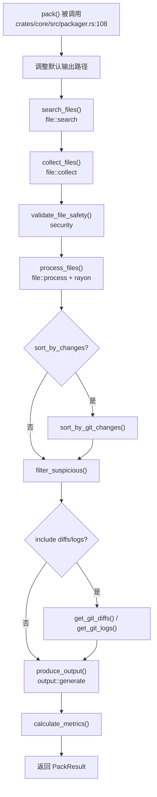

# Packager 领域

**模块路径**：`crates/core/src/packager.rs`
**生成日期**：2026-06-14
**分析置信度**：9/10

---

## 概述

Packager 是整个 repomix-rs 的"生产经理"——它不直接参与文件搜索、内容处理或格式生成，但它清楚这六道工序的精确顺序和输入输出规格。`pack()` 函数是整条流水线的唯一对外入口，接收一个或多个 `root_dir`、一份合并后的 `RepomixConfig`、一个 `ProgressCallback` 实现，然后依次调起每个工位，并确保数据在半成品工位间顺畅传递。

在设计上，Packager 遵循了"好莱坞原则"——不要调用我们，我们会调用你。调用方只需把配置和进度回调传进来，剩下的全部由 Packager 自动完成。

---

## 核心功能点

1. **流水线编排**：`pack()`（`crates/core/src/packager.rs:108`）按固定顺序执行 6 道工序——文件搜索（`file::search::search_files`）、文件收集（`file::collect::collect_files`）、安全验证（`security::validate::validate_file_safety`）、文件处理（`file::process::process_files`）、输出生成（`output::generate::produce_output`）、指标计算（`metrics::calculate::calculate_metrics`）。每个步骤的输出类型是下一步的输入类型，类型系统保证组合的正确性。

2. **可选功能降级**：Git 变更排序（`git::sort::sort_by_git_changes`）、Git diff/log 获取、剪贴板复制（`arboard::Clipboard::set_text`）等可选功能都包裹在条件判断或 `Result` 处理中。失败时发 `tracing::warn!` 而非传播错误。

3. **进度回调**：`ProgressCallback` trait（`crates/core/src/packager.rs:94`）定义了三个方法——`on_progress`、`on_complete`、`on_error`。Packager 在每道工序开始和结束时回调，使调用方可以实现自定义的进度展示。

4. **可疑文件过滤**：`filter_suspicious()`（`crates/core/src/packager.rs:275`）从处理后的文件集合中剔除所有被安全扫描标记为可疑的文件，确保最终输出中不包含可能的密钥/凭证。

---

## 关键组件

| 组件/类型 | 文件路径 | 核心职责 |
|---------|---------|---------|
| `pack()` | `crates/core/src/packager.rs:108` | 异步主函数，编排完整打包流水线 |
| `PackOptions` | `crates/core/src/packager.rs:44` | Builder 模式选项，链式设置 root_dirs 和 config |
| `PackResult` | `crates/core/src/packager.rs:19` | 打包结果：统计、路径、内容、安全报告 |
| `ProgressCallback` | `crates/core/src/packager.rs:94` | 进度回传 trait，3 个回调方法 |
| `NoopProgress` | `crates/core/src/packager.rs:100` | 空实现——用于 MCP 等不需要 CLI 动画的场景 |
| `filter_suspicious()` | `crates/core/src/packager.rs:275` | 从 ProcessedFile 列表移除可疑文件 |

---

## 内部数据流

**关键步骤说明**：
1. 配置调整：如果 `file_path` 是默认值，根据输出 style 自动选择合适的扩展名（`.xml` / `.md` / `.json` / `.txt`）
2. 文件搜索：使用 `ignore::WalkBuilder` 多线程遍历，配合默认/用户/项目三层忽略模式
3. 文件收集：rayon 并行读取文件内容，UTF-8 检测 → UTF-16 BOM 检测 → chardetng 编码推断 → 跳过二进制
4. 安全验证：在 `spawn_blocking` 线程中执行，7 条 Secret 规则逐行扫描
5. 文件处理：rayon 并行，按配置依次执行注释去除 → tree-sitter 压缩 → Base64 截断 → 空行压缩 → 行号添加
6. 输出生成：根据 style 分发到 4 种格式渲染器，可选分片和剪贴板复制

---

## 关键接口与扩展点

`ProgressCallback` trait 是 Packager 唯一的扩展机制。调用方可以通过实现该 trait 来自定义进度展示方式。目前有两个内置实现：CLI 的 `Spinner`（显示旋转动画和消息）和 MCP 的 `NoopProgress`（静默模式）。

---

## 与其他模块的交互

| 交互模块 | 方向 | 接口/协议 | 说明 |
|---------|------|---------|------|
| file::search | 依赖 | `search_files()` | 获取文件路径列表 |
| file::collect | 依赖 | `collect_files()` | 读取文件内容 |
| file::process | 依赖 | `process_files()` | 并行处理文件内容 |
| security::validate | 依赖 | `validate_file_safety()` | 安全扫描 |
| output::generate | 依赖 | `produce_output()` | 输出生成 |
| metrics::calculate | 依赖 | `calculate_metrics()` | 指标计算 |
| git::diff/log/sort/remote | 依赖 | `get_git_diffs()` 等 | 可选 Git 操作 |
| config::load | 依赖 | `RepomixConfig::load()` | 配置加载 |

---

## 跨模块协作场景

**在本地目录打包流程中**：Packager 是整条流水线的启动器和协调器。CLI 调用 `pack()` 后，Packager 负责依次调起 file、security、git、output、metrics 五个模块，并将最终结果返回给 CLI。

---

## 性能考量

Packager 自身不做密集计算，它的编排策略决定了整体并行度：
- 文件搜索和收集各自使用独立 `spawn_blocking` 任务
- 文件处理使用 `rayon` 自动利用所有 CPU 核
- 所有 `await` 都在 tokio 异步线程上执行，不阻塞

---

## 实现亮点

- **filter_suspicious 使用 HashSet 实现 O(1) 查找**：将可疑文件路径构建为 `HashSet<&Path>`，然后在 ProcessedFile 列表上线性过滤（`crates/core/src/packager.rs:279-285`）
- **输出路径的 RAII 管理**：CLI 和 MCP 都使用 RAII guard 管理临时目录和临时输出文件，确保异常退出时也能自动清理

---

**分析置信度说明**：9/10 — 基于对 `pack()` 函数的完整阅读和与 6 个子模块的交互追踪。所有功能的代码实现都有明确的对应引用。仅 `NoopProgress` 的用途（MCP 场景）是基于推理而非直接观察。
