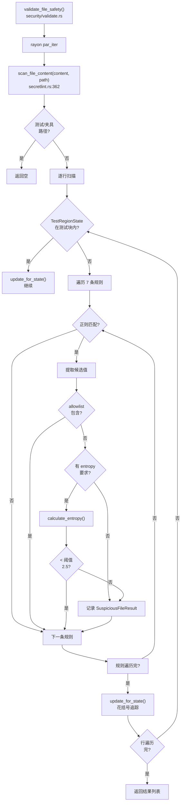

# Security 领域

**模块路径**：`crates/core/src/security/`
**生成日期**：2026-06-14
**分析置信度**：9/10

---

## 概述

Security 模块是流水线的"安检门"——它检查每个文件是否包含 API 密钥、token、密码等敏感信息。被标记为可疑的文件会被从最终输出中排除。与外部安全工具（如 truffleHog、Gitleaks）不同，repomix-rs 的 Secretlint 是深度定制的——它知道 `#[test]` 块中的"假密钥"是测试夹具，知道 `your-api-key` 是占位符不应报警。这种语言感知的假阳性过滤在代码打包场景中至关重要。

---

## 核心功能点

1. **7 条检测规则**：`build_secret_rules()`（`/Users/bjsttlp485/Workspace/SAW/repomix-rs/crates/core/src/security/secretlint.rs:23`）定义 7 种模式——通用 API Key、通用 Secret、通用 Token、AWS Access Key、AWS Secret Key、GitHub Token、Private Key。前 3 种带熵阈值（2.5），后 4 种纯模式匹配。

2. **三层假阳性过滤**：**allowlist**（白名单值如 `your-api-key`、`changeme`）、**熵阈值**（香农熵 < 2.5 的"弱口令"放过）、**测试区域跳过**（Rust `#[test]`/`#[cfg(test)]` 块内花括号追踪）。这是与外部工具的关键区别点。

3. **跨生态测试路径感知**：`is_test_fixture_path()`（`/Users/bjsttlp485/Workspace/SAW/repomix-rs/crates/core/src/security/secretlint.rs:344`）覆盖 Android、iOS、KMP、Web（Jest）、Pytest、Go 等生态的测试目录/文件名模式。

---

## 关键组件

| 组件/类型 | 文件路径 | 核心职责 |
|---------|---------|---------|
| `SecretRule` | `crates/core/src/security/secretlint.rs:7` | 检测规则：id + 正则 + 熵阈值 + allowlist |
| `SECRET_RULES` | `crates/core/src/security/secretlint.rs:16` | OnceLock 全局缓存正则 |
| `scan_file_content()` | `crates/core/src/security/secretlint.rs:362` | 单文件逐行扫描 |
| `calculate_entropy()` | `crates/core/src/security/secretlint.rs:412` | 字节级香农熵计算 |
| `TestRegionState` | `crates/core/src/security/secretlint.rs:145` | 花括号深度追踪测试区域 |
| `is_test_fixture_path()` | `crates/core/src/security/secretlint.rs:344` | 路径/文件名测试识别 |

---

## 内部数据流

**关键步骤说明**：
1. 测试区域追踪：`TestRegionState` 维护 `brace_depth`（当前花括号深度）、`test_block_start`（`#[test]` 后第一个开括号时的深度）。当当前深度 >= start 时，认为在测试块内
2. 熵计算：字节级香农熵在 256 个 u32 计数数组上计算，零分配

---

## 关键接口与扩展点

添加新规则的步骤：
1. 在 `build_secret_rules()` 中新增 `SecretRule`
2. 调用 `safe_compile()` 编译正则（编译失败不 panic，发 warning 禁用该规则）
3. 选择熵阈值或纯模式匹配
4. 添加 allowlist 条目

---

## 与其他模块的交互

| 交互模块 | 方向 | 接口/协议 | 说明 |
|---------|------|---------|------|
| shared::types | 依赖 | `SuspiciousFileResult` | 检测结果的数据类型 |

---

## 跨模块协作场景

**在打包流程中的位置**：packager 在 `collect_files()`（获取 `RawFile`）之后、`process_files()`（内容处理）之前调用 `validate_file_safety()`。这意味着安全扫描基于原始文件内容（尚未压缩/去注释）。

---

## 性能考量

- **正则一次编译**：使用 `OnceLock` 全局缓存 7 条正则，首次调用编译，后续复用
- **零分配熵计算**：256 个 u32 的栈上数组，无堆分配
- **花括号追踪**：仅维护一个 `u32 brace_depth`，逐行加减，O(1) 级开销
- **rayon 并行**：多文件的扫描分布在所有工作线程上

---

## 实现亮点

- **安全正则编译**：`safe_compile()` 在正则编译失败时不 panic，构造一个永不匹配的占位正则并打 warning（`/Users/bjsttlp485/Workspace/SAW/repomix-rs/crates/core/src/security/secretlint.rs:127-142`）
- **allowlist 双重检查**：先检查候选值（`candidate.contains(allow)`），再检查整行（`line.contains(allow)`），确保不会遗漏
- **测试夹具的双重识别**：`is_test_fixture_path()` 联合使用文件名（`*.test.*`）、路径段（`tests/`、`fixtures/`）和源码目录（`src/test/`）三种策略

---

**分析置信度说明**：9/10 — 完整阅读了 `secretlint.rs`（含全部 7 条规则和测试区域追踪逻辑）和 `validate.rs`。所有 3 层过滤（allowlist、entropy、test region）的代码实现确认。
