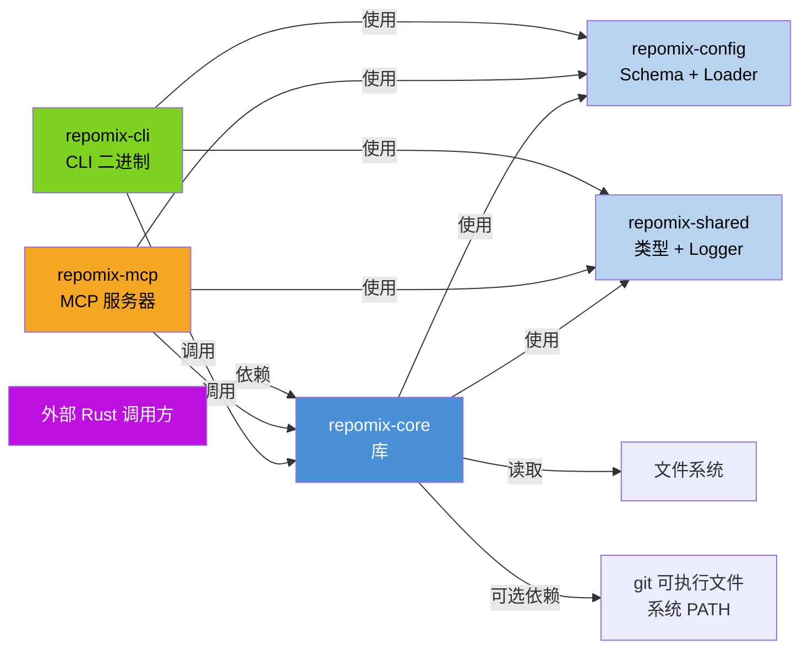

# 2. 架构

`repomix-rs` 的架构是一幅典型的"单一心脏、多个接口"图：三条对外通路（CLI、MCP、库 API）都指向 `repomix-core` 的同一个 `pack()` 函数。`repomix-core` 再以流水线的形式把任务分派给六个专职子模块，而 `repomix-config` 和 `repomix-shared` 像脊柱一样把 schema 和数据类型悬在所有模块之间。整体风格是**六边形架构 / Ports and Adapters**：`repomix-cli` 和 `repomix-mcp` 是两个"驱动适配器"（Driving Adapters），`repomix-core` 是"端口与业务逻辑"（Ports & Logic），外面的文件系统和 git 是"被驱动端口"（Driven Ports）。

## 2.1 C4 Container 图



这个图最值得注意的地方是**依赖方向**。`repomix-cli` 和 `repomix-mcp` 都向核心调用，但 core 对它们零依赖。反过来，core 依赖的是 `config` 和 `shared` 这两个更基础的 crate，而不是反过来。这个方向保证了 core 既可以被 CLI 消费，也可以被别的 crate 直接依赖，天然适合做库发布。

`repomix-config` 和 `repomix-shared` 处于架构的"脊柱"位置，不直接关心打包流程的编排，只负责把 schema 制造出来和把类型悬挂起来。所有 crate 都可以用它们，但它们也只需要 `serde` 和 `thiserror` 级别的依赖。

## 2.2 C4 Component 图（repomix-core 内部）

```mermaid
graph TD
    %% Nodes
    PKG[pack()\n Orchestrator]
    FS[file::search\n文件搜索]
    FC[file::collect\n内容收集]
    SEC[security::validate\n安全验证]
    PROC[file::process\n内容处理]
    TS[tree_sitter::compress\n代码压缩]
    OUT[output::generate\n输出生成]
    MET[metrics::calculate\n指标计算]
    GT[git\nGit 操作]

    %% Edges
    PKG --> FS
    FS --> FC
    FC --> SEC
    SEC --> PROC
    PROC --> TS
    PROC -->|转给| GT
    GT -->|可选排序| PROC
    PROC --> OUT
    OUT --> MET
    MET --> PKG

    style PKG fill:#4A90D9,color:#fff
    style PROC fill:#F5A623,color:#000
    style TS fill:#FF3B30,color:#fff
    style SEC fill:#BD10E0,color:#fff
    style GT fill:#007AFF,color:#fff
```

这六个子模块（`file`, `tree_sitter`, `security`, `output`, `metrics`, `git`）是核心的内部划分。packager（`pack()`）是启动器，负责调度时序和决定下一步。你会发现这段流水线里**内聚非常高**：`file::process` 吸收了 tree-sitter 压缩、注释删除、base64 截断和 token 计数，`git` 是一个并行的旁支（排序 + 可选的 diff/log 提取）。

## 2.3 模块职责一览

| Crate / 模块 | 职责 | 重要性评分 |
|---|---|---|
| `repomix-cli` | CLI 入口、`--init` 向导、UI 反馈（spinner、report） | 8 |
| `repomix-mcp` | MCP stdio 服务、4 个工具路由 | 6 |
| `repomix-core` | `pack()` 编排、文件流水线、压缩、输出、git | 10 |
| `repomix-config` | `RepomixConfig` schema、分层加载、默认忽略模式 | 8 |
| `repomix-shared` | `RawFile`/`ProcessedFile`/`SuspiciousFileResult` 等类型、logger | 7 |

## 2.4 关键抽象

`pack()` 是核心的入口抽象，接收 `Vec<PathBuf>`（一个或多个根目录）、一个 `RepomixConfig` 和一个 `Box<dyn ProgressCallback>` trait object。返回 `PackResult`。

`PackOptions` 是 builder pattern 的封装器，让库用户不必手工组包 config。

`ProgressCallback` trait 把进度通知从业务逻辑抽离出来：CLI 实现里包了个打印动画的 spinner，MCP 实现里可以透明地换成一个 JSON-RPC 的进度通知，打包函数本身完全不需要改动。

## 2.5 数据流（核心循环）

```text
用户 / agent
   │
   ▼ 构造 RepomixConfig
repomix-core::pack()
   │
   ├─▶ file::search       → FileSearchResult { file_paths, empty_dirs }
   │
   ├─▶ file::collect      → FileCollectResult { raw_files: Vec<RawFile>, skipped }
   │
   ├─▶ security::validate → ValidationResult { suspicious, safe }
   │
   ├─▶ file::process      → Vec<ProcessedFile>
   │        └── tree_sitter::compress (if enabled)
   │        └── remove_comments / empty_lines / truncate_base64 / line_numbers
   │        └── token_count (tiktoken-rs or whitespace fallback)
   │
   ├─▶ git::sort (optional) → reorder by recency
   │
   ├─▶ filter_suspicious  → drop suspicious files
   │
   ├─▶ git::diff / log (optional) → strings
   │
   └─▶ output::generate   → write files
   │
   ▼
metrics::calculate      → totals + top-N
   │
   ▼ 返回
PackResult
```

这份数据流从首到尾穿越了七个阶段，每个阶段的产物都是下一个阶段的输入。一个关键的观察是：**所有中间数据结构都只在内存里流动**，没有 mmap，没有流式写入，没有管道式的零拷贝。这意味着打包过程的内存占用约等于所有文件内容之和，上限取决于机器 RAM。对于常规项目这没有问题，但对超大型 mono-repo（GB 级代码量）是一个软边界。

## 2.6 并发模型

`pack()` 的主体还在单个 Tokio task 里串行执行，真正的并发窗口只有两处：

1. **Rayon 的 `par_iter`** —— 在 `file::process::process_files` 里，每个 `RawFile` 被独立处理（tree-sitter 解析、注释删除、token 计数）， rayon 的 work-stealing 调度器负责把它们分散到各 CPU 核。这是整个工具里最主要的速度来源。

2. **MCP 的 `lock`（Mutex）** —— `RepomixMcpServer` 持有一个 `Arc<Mutex<()>>` 锁，保证同一时刻只有一个 MCP 工具正在调用 `pack()`。这样避免了并发 `pack()` 调用共享临时目录、共享日志、共享任何全局状态的风险。代价是 MCP 模式下无法并行处理多个 agent 请求。

## 2.7 设计权衡与遗留问题

第一个可见的权衡是 **Git 能力依赖系统 `git` 可执行文件**。不链接 libgit2，二进制更小、无 ABI 兼容问题；但远程克隆、diff、log、按变更排序都需要用户环境已安装 Git 且能在 `PATH` 中找到。非 git 目录或缺少 `git` 时，相关步骤跳过并打警告，不影响其余打包流程。

第二，**搜索阶段是单线程的，处理阶段是多线程的**。`ignore` crate 没有提供带 glob 过滤的并行 walker，所以为了语义正确性（`.gitignore` 精确匹配），搜索用了最简单的递归遍历。处理阶段才用 rayon 并发。这个代价是小：搜索只是读文件名，真正的 I/O 瓶颈在文件内容读取。

第三，**C# tree-sitter 压缩被禁用**。`tree-sitter-c-sharp` 0.23 版本和本仓库的 `queries/c_sharp.scm` 文件之间存在 ABI 不兼容，注释在 `crates/core/Cargo.toml` 里明确写了修复编号，说明团队是意识到了这个需求、暂时绕开了问题。

第四，**源码里保留了大量历史 bug 修复注释**（P0、P1、P2、Bug #N）。这些注释记录了改过的动机和位置，对理解演变历史很有帮助，但放在生产代码里显得凌乱，也提示项目的清理策略还没完全尘埃落定。

## 2.8 架构总结

`repomix-rs` 是一个**小型而专注的领域工具**，它的架构没有任何炫技：五 crate 的 Cargo workspace 切分得很干净，核心流水线是七步顺序处理，只有处理步骤是多线程的。这种"简单为核心"的风格反而让它容易理解、容易测试、容易嵌入。要扩展的话，最自然的接口是 `repomix-core` 的 `pack()` 函数和 `OutputStyle` 枚举——加一种输出风格，或者加一种 tree-sitter 语言，只需要在一个 crate 里动刀。
