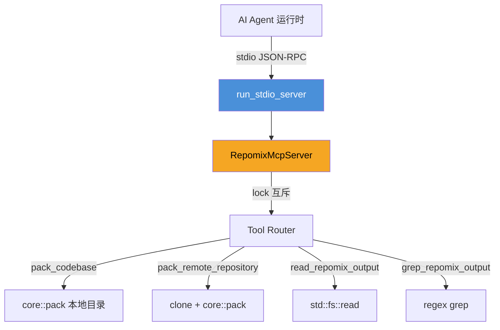

# 3. 工作流

`repomix-rs` 有一条贯穿始终的主干：用户（或 agent）发起打包请求 → 核心库 `pack()` 以流水线的方式串联七个阶段 → 产出打包结果。除此之外还有三条次要通路：`--init` 配置文件向导、MCP 服务模式、和远程仓库的 git clone 流程。理解了主干的顺序和每条支路的嵌入手法，整个系统的控制流就毫无悬念。

## 3.1 主工作流：pack() 流水线（时序图）

```mermaid
sequenceDiagram
    actor U as 用户 / Agent
    participant CLI as cli::main()
    participant R as run::run_pack()
    participant CFG as config::load
    participant PKG as core::pack()
    participant FS as file::search
    participant FC as file::collect
    participant SEC as security::validate
    participant PROC as file::process
    participant GIT as git::*
    participant OUT as output::generate
    participant MET as metrics::calculate

    U->>CLI: repomix [OPTIONS] [ROOT]
    CLI->>R: 解析后调用
    R->>CFG: RepomixConfig::load(partial, config_root)
    CFG-->>R: RepomixConfig

    R->>PKG: pack(root_dirs, config, progress)

    PKG->>FS: search_files(root_dirs, config)
    FS-->>PKG: FileSearchResult

    PKG->>FC: collect_files(paths, config)
    FC-->>PKG: FileCollectResult { raw_files }

    PKG->>SEC: validate_file_safety(raw_files, config)
    SEC-->>PKG: ValidationResult { suspicious }

    PKG->>PROC: process_files(raw_files, config)
    Note over PROC: Rayon par_iter 并行
    PROC-->>PKG: Vec<ProcessedFile>

    alt 配置了 sort_by_changes
        PKG->>GIT: sort_by_git_changes(processed, root)
        GIT-->>PKG: (原地重排)
    end

    PKG->>PKG: filter_suspicious(processed, validation)

    opt 可选：git diff
        PKG->>GIT: get_git_diffs(root)
        GIT-->>PKG: diff_content
    end
    opt 可选：git log
        PKG->>GIT: get_git_logs(root, n)
        GIT-->>PKG: log_content
    end

    PKG->>OUT: produce_output(filtered, config, diff, log, empty_dirs)
    OUT-->>PKG: OutputResult { files }

    PKG->>MET: calculate_metrics(filtered, config)
    MET-->>PKG: MetricsResult

    PKG-->>R: PackResult
    R->>U: print_report(result); 返回
```

这张时序图揭示了 `pack()` 的**序列骨架**：七个阶段有固定的前后依赖，不能打乱。唯一可选的旁支是 git 操作（diff / log / sort），它们挂在整个 pipeline 的不同时刻，失败也只是打印警告、不影响主流程。

## 3.2 支路一：--init 配置向导

这条通路不经过 `pack()`，走 `cli::init_config()`：

```mermaid
graph LR
    U[用户] -->|repomix --init| I[init_config()]
    I --> P1[prompts::create_config_file]
    P1 -->|交互式问答| C[repomix.config.json]
    I --> P2[prompts::create_ignore_file]
    P2 -->|预设 + 自定义| IG[.repomixignore]

    style C fill:#4A90D9,color:#fff
    style IG fill:#7ED321,color:#000
```

向导用 `dialoguer` 在终端里提问，然后写出两个文件到当前目录。生成的配置包含默认推荐的 include/ignore 规则，`.repomixignore` 是补充过滤清单。两者都在后续 `RepomixConfig::load` 时被读取。

## 3.3 支路二：MCP 服务模式

`repomix --mcp` 启动一个基于 `rmcp` 的 stdio JSON-RPC 服务：



关键设计点：`RepomixMcpServer` 持有一个 `lock`（`Arc<Mutex<()>>`），所有工具调用序列化。这在多 agent 高并发场景会是瓶颈，但在当前版本（单 agent 串行调用）是足够正确的选择。

`pack_remote_repository` 在 MCP 模式下也会创建临时目录并用 `TempDirGuard` 清理，实现与 CLI 版本相同的行为，只是实现各自独立（避免 crate 之间的循环依赖）。

## 3.4 支路三：远程仓库

无论是 CLI 的 `--remote` 还是 MCP 的 `pack_remote_repository`，都复用了同一套逻辑：

```mermaid
graph LR
    URL[远程 URL] --> TD[创建唯一临时目录]
    TD --> CL[git clone --depth 1]
    CL --> PK[core::pack(temp_dir)]
    PK --> RES[PackResult]
    RES --> CLN[TempDirGuard::drop → 删除目录]

    style TD fill:#B8D4F0,color:#000
    style PK fill:#4A90D9,color:#fff
```

临时目录名格式：`repomix_remote_{PID}_{nanos}_{hash_hex}`，保证并发、多用户、多实例场景下的隔离。

## 3.5 并发模型

```mermaid
graph LR
    subgraph Tokio 单线程任务
        direction LR
        S1[search] --> C1[collect] --> SEC1[validate] --> P1[process]
    end
    subgraph Rayon 线程池
        direction LR
        F1[File 1] --- F2[File 2] --- FN[File N]
    end

    P1 -.->|par_iter| Rayon 线程池

    subgraph MCP 互斥锁
        direction LR
        L[Arc&lt;Mutex&lt;()&gt;&gt;]
    end

    MCP[RepomixMcpServer] -.->|持有| L

    style Tokio 单线程任务 fill:#B8D4F0,color:#000
    style Rayon 线程池 fill:#FF3B30,color:#fff
    style MCP 互斥锁 fill:#F5A623,color:#000
```

- **主流程是串行的**：Tokio 在一个 task 里跑完 search → collect → validate → process → output → metrics。
- **文件处理是并行的**：rayon 的 `par_iter` 在每个核心上独立处理一个文件，tree-sitter AST 解析和 token 计数是这里的主要耗时。
- **MCP 是互斥的**：多个 agent 请求被 `lock` 串行化，同一时刻只有一个 `pack()` 在执行。

## 3.6 错误处理策略

| 出错点 | 处理方式 | 对用户/agent 的可见性 |
|---|---|---|
| `file::search` I/O 失败 | 传播 `anyhow::Error`，调用方中止 | 高，错误信息展示在终端/协议的 error 字段 |
| 文件大小超限 | 记录 `SkippedFileInfo`，继续处理 | 低，最终报告里标注跳过的文件 |
| tiktoken 初始化失败 | `tracing::warn` 降级为 `split_whitespace` | 中，日志可见，报告 token 数可能偏低 |
| Secretlint 命中规则 | 加入 `suspicious` 集合，输出中剔除；不中止 | 中，最终报告列出可疑文件 |
| Git diff/log 失败 | `tracing::warn`，静默跳过该部分 | 低，输出中不含 diff/log 段落 |
| Git sort 失败 | `tracing::warn`，保持搜索顺序 | 低，不影响最终输出 |
| 远程 clone 失败 | 传播 `anyhow::Error`，中止 | 高，错误描述包含 git clone 原因 |
| MCP 工具调用失败 | 包装为 `rmcp::Error`，回传 JSON-RPC | 高，agent 收到 error 字段 |
| TempDirGuard drop 失败 | best-effort `eprintln!` warn，不传播 | 低，进程可能残留 `/tmp` 目录 |

一个总体原则：**安全相关的失败不影响别的文件**（Secretlint 只过滤命中文件，其余继续），**外部命令的失败是软性的**（git diff/log 跳过），**核心 I/O 的失败是硬性的**（clone 失败直接报告）。

## 3.7 工艺总结

整个工作流可以概括为一句话：**`pack()` 用串行编排 + 内部 rayon 并行的方式，把输入的一堆文件逐步翻译成一份对 LLM 更友好的文本报告**。外部世界看到的是一条简洁的 CLI 命令或一个 JSON-RPC 工具调用；内部世界则是一个精心设计的七阶段管道，每个阶段的产出是下一阶段的输入，出错时根据严重程度决定是中止还是降级。
